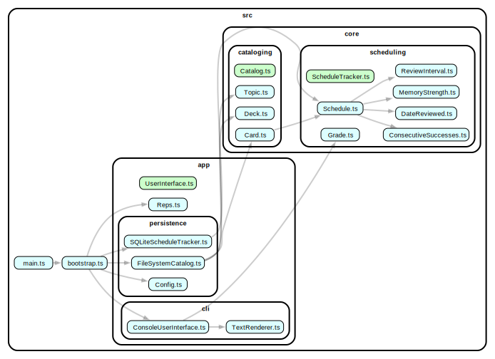

# Reps

[](https://www.gnu.org/licenses/gpl-3.0)

A CLI flashcard app using the SuperMemo SM-2 spaced repetition algorithm.

## Idiosyncrasies

This is a Petri dish, not production code.

- **100% code coverage:** Does it hurt or help?
- **OOP over type gymnastics:** Classes instead of TypeScript's type system. Easier? Harder? More verbose?
- **Immutability-first:** Kotlin encourages this. How does it shape TypeScript?
- **Deep classes, narrow interfaces:** Ousterhout's philosophy.
  Do narrow interfaces make tests focus on behavior instead of implementation?

The code may look odd.

(Some thoughts/concerns are already getting shape during development...)

- Code coverage can create a false sense of security.
- The code coverage is a good negative indicator, but a bad positive one.
- I want to think more about the test implementations. It looks mostly classical now, I will try more London style.

## Study Flow

When you run `reps`, you see a topic tree showing cards due for review (when implemented):

```
$ reps

4 out of 7 cards are ready to be reviewed.

 catalog (8 cards: 6 due)
 ├── clean-code (4 cards: 3 due)
 │   └── refactoring (1 card: done)
 └── error-handling (3 cards: 3 due)

Pick a topic to review: clean-code
```

**Review Process:**

1. Choose a topic from the tree
2. Answer the question, reveal the answer
3. Grade your recall to schedule the next review
4. Continue until you finish all cards in the topic
5. Return to the topic tree or finish if no cards remain

## Core Concepts



### Card

A flashcard with a question and answer, stored as a plain text file separated by `???`.

**Format:**

```txt
What is the capital of France?
???
Paris.
```

**Key Points:**

- One card per file
- Format: question, then `???`, then answer
- Content can be text, code, formulas, anything
- File names are descriptive but don't affect functionality
- Schedule tracks performance and schedules the next review

### Topic

A subject category that groups related cards. Each topic is a directory in your catalog.

**Characteristics:**

- Contains cards (files in the directory)
- Can have subtopics (subdirectories)
- Cards inherit their parent topic's hierarchy
- Names are descriptive and logically organized

### Catalog

Your complete collection of study material—the root directory containing all topics and cards.

**Structure Example:**

```
catalog/
├── clean-code/
│   ├── function-naming.txt
│   ├── single-responsibility.txt
│   └── refactoring/
│       └── code-smells.txt
└── error-handling/
    ├── define-errors-out.txt
    ├── exception-complexity.txt
    └── untested-exceptions.txt
```

### Deck

A collection of cards assembled for study.

**Types:**

- Topic Deck: All cards from a topic and its subtopics
- Review Deck: Only cards due for review based on the spaced repetition algorithm

### Student

You. The student:

- Selects topics to study
- Reviews cards and self-evaluates answers
- Assigns review grades based on recall
- Advances through review sessions

### Topic Tree

**Structure:**

- Root: The catalog directory containing all top-level topics
- Topic: A subject area containing:
  - Multiple subtopics
  - One deck with all cards for that topic

### Schedule

Reps' memory system.
It tracks your performance with each card, records retention grades,
calculates when to review each card next using SM-2,
and schedules cards based on performance: better recall means longer intervals.

### Spaced Repetition (SM-2 Algorithm)

Reps uses the SuperMemo SM-2 algorithm to optimize review timing.
Cards you struggle with appear more frequently.
Cards you master appear less often.
Review intervals increase exponentially for well-remembered cards.

## Design Decisions

- Cards and Topics: Plain text files in the filesystem (not in database)
- Schedule: SQLite database tracking performance and review schedules
- Card Identification: SHA-1 hash of text file content

This hybrid approach keeps study material editable as plain text while maintaining performance data in a structured database.

## Development

```bash
# Build for production.
pnpm build

# Run linter/formatter with auto-fix.
pnpm fix

# Run the tests (including the snapshot tests).
pnpm test

# Generate dependency graph (requires GraphViz).
pnpm graph
```

## SM-2 Algorithm

[Original article on Wikipedia](https://en.wikipedia.org/wiki/SuperMemo)

The first computer-based SuperMemo algorithm (SM-2) tracks three properties for each card being studied:

- The repetition number n, which is the number of times the card has been successfully recalled
  (meaning it was given a grade ≥ 3) in a row since the last time it was not.
- The easiness factor EF, which loosely indicates how "easy" the card is
  (more precisely, it determines how quickly the inter-repetition interval grows). The initial value of EF is 2.5.
- The inter-repetition interval I, which is the length of time (in days)
  SuperMemo will wait after the previous review before asking the user to review the card again.

Every time the user starts a review session,
SuperMemo provides the user with the cards whose last review occurred at least I days ago.
For each review, the user tries to recall the information and (after being shown the correct answer)
specifies a grade q (from 0 to 5) indicating a self-evaluation of the quality of their response,
with each grade having the following meaning:

- 0: Total blackout, complete failure to recall the information.
- 1: Incorrect response, but upon seeing the correct answer, it felt familiar.
- 2: Incorrect response, but upon seeing the correct answer, it seemed easy to remember.
- 3: Correct response, but required significant effort to recall.
- 4: Correct response, after some hesitation.
- 5: Correct response with perfect recall.

The following algorithm is then applied to update the three variables associated with the card:

```
algorithm SM-2 is
    input:  user grade q
            repetition number n
            easiness factor EF
            interval I
    output: updated values of n, EF, and I

    if q ≥ 3 (correct response) then
        if n = 0 then
            I ← 1
        else if n = 1 then
            I ← 6
        else
            I ← round(I × EF)
        end if
        increment n
    else (incorrect response)
        n ← 0
        I ← 1
    end if
    
    EF ← EF + (0.1 − (5 − q) × (0.08 + (5 − q) × 0.02))
    if EF < 1.3 then
        EF ← 1.3
    end if
    
    return (n, EF, I)
```

After all scheduled reviews are complete, SuperMemo asks the user to re-review any cards they marked
with a grade less than 4 repeatedly until they give a grade ≥ 4.
